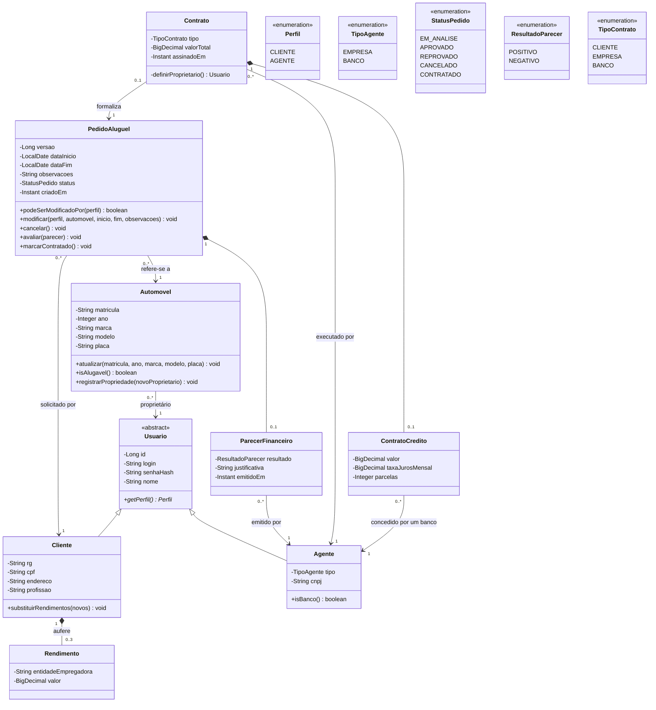

# Diagrama de Classes (v1)

Corresponde às entidades do pacote `br.pucminas.aluguelcarros.model`.

```mermaid
classDiagram
    direction TB

    class Usuario {
        <<abstract>>
        -Long id
        -String login
        -String senhaHash
        -String nome
        +getPerfil()* Perfil
    }
    class Cliente {
        -String rg
        -String cpf
        -String endereco
        -String profissao
        +substituirRendimentos(novos) void
    }
    class Rendimento {
        -String entidadeEmpregadora
        -BigDecimal valor
    }
    class Agente {
        -TipoAgente tipo
        -String cnpj
        +isBanco() boolean
    }
    class Automovel {
        -String matricula
        -Integer ano
        -String marca
        -String modelo
        -String placa
        +atualizar(matricula, ano, marca, modelo, placa) void
        +isAlugavel() boolean
        +registrarPropriedade(novoProprietario) void
    }
    class PedidoAluguel {
        -Long versao
        -LocalDate dataInicio
        -LocalDate dataFim
        -String observacoes
        -StatusPedido status
        -Instant criadoEm
        +podeSerModificadoPor(perfil) boolean
        +modificar(perfil, automovel, inicio, fim, observacoes) void
        +cancelar() void
        +avaliar(parecer) void
        +marcarContratado() void
    }
    class ParecerFinanceiro {
        -ResultadoParecer resultado
        -String justificativa
        -Instant emitidoEm
    }
    class Contrato {
        -TipoContrato tipo
        -BigDecimal valorTotal
        -Instant assinadoEm
        -definirProprietario() Usuario
    }
    class ContratoCredito {
        -BigDecimal valor
        -BigDecimal taxaJurosMensal
        -Integer parcelas
    }
    class Perfil {
        <<enumeration>>
        CLIENTE
        AGENTE
    }
    class TipoAgente {
        <<enumeration>>
        EMPRESA
        BANCO
    }
    class StatusPedido {
        <<enumeration>>
        EM_ANALISE
        APROVADO
        REPROVADO
        CANCELADO
        CONTRATADO
    }
    class ResultadoParecer {
        <<enumeration>>
        POSITIVO
        NEGATIVO
    }
    class TipoContrato {
        <<enumeration>>
        CLIENTE
        EMPRESA
        BANCO
    }

    Usuario <|-- Cliente
    Usuario <|-- Agente
    Cliente "1" *-- "0..3" Rendimento : aufere
    PedidoAluguel "0..*" --> "1" Cliente : solicitado por
    PedidoAluguel "0..*" --> "1" Automovel : refere-se a
    Automovel "0..*" --> "1" Usuario : proprietário
    PedidoAluguel "1" *-- "0..1" ParecerFinanceiro
    ParecerFinanceiro "0..*" --> "1" Agente : emitido por
    Contrato "0..1" --> "1" PedidoAluguel : formaliza
    Contrato "0..*" --> "1" Agente : executado por
    Contrato "1" *-- "0..1" ContratoCredito
    ContratoCredito "0..*" --> "1" Agente : concedido por um banco
```
